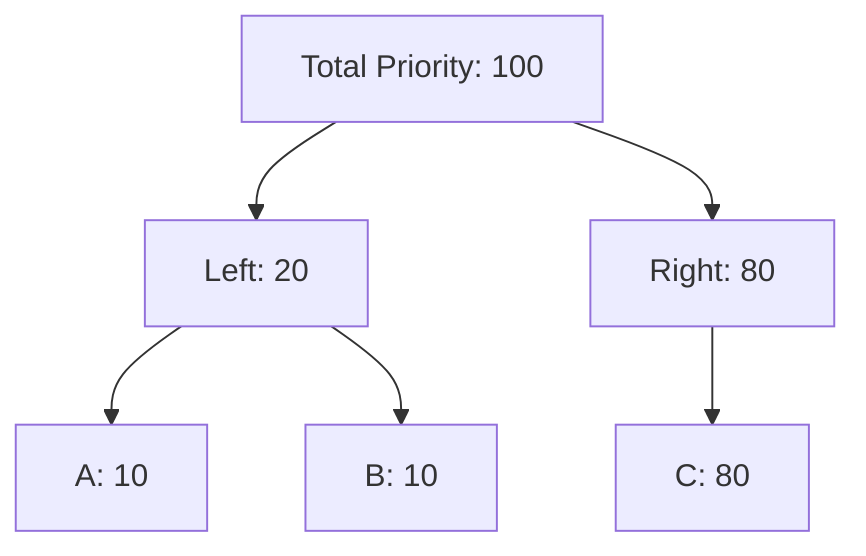

# DQN Agent Skill
- status: active
- type: agent_skill
- id: solvers.dqn_agent.skill
- last_checked: 2026-02-13
<!-- content -->
This document describes the **Deep Q-Network (DQN) Agent** implemented for the Snake Game. It serves as a reference for the agent's architecture, training process, and usage.

**Key Design Choice**: unlike a simple score-based agent, this implementation uses **Reward Shaping** to encourage efficiency. A small negative penalty is applied at every time step to prevent the agent from wandering aimlessly, forcing it to seek the shortest path to food.

## Architecture
- status: active
- type: context
- id: solvers.dqn_agent.architecture
- last_checked: 2026-02-13
<!-- content -->
The `DQNAgent` uses a Convolutional Neural Network (CNN) to process the game grid directly.

### Observation Space
- **Shape**: `(4, 32, 32)` corresponding to `(Channels, Height, Width)`.
- **Channels**:
    1.  **Snake Body**: 1.0 where the body segments are, 0.0 otherwise.
    2.  **Snake Head**: 1.0 at the head position.
    3.  **Food**: 1.0 at the food position.
    4.  **Obstacles**: Reserved for future use (currently empty).

### Network Structure
- **Conv1**: 32 filters, 5x5 kernel, stride 2. Output: 14x14.
- **Conv2**: 64 filters, 3x3 kernel, stride 1. Output: 12x12.
- **Conv3**: 64 filters, 3x3 kernel, stride 1. Output: 10x10.
- **FC1**: Fully Connected Layer (6400 -> 512).
- **FC2**: Output Layer (512 -> 4 actions).
- **Activation**: ReLU is used for all hidden layers.

## Training Protocol
- status: active
- type: protocol
- id: solvers.dqn_agent.training_protocol
- last_checked: 2026-02-13
<!-- content -->
The agent is trained using the **Double DQN** algorithm to reduce overestimation bias.

### Full Curriculum Learning (Key Strategy)
To address the difficulty of sparse rewards on a 32x32 grid, we implement a **Full Curriculum** that decomposes the general game into proper subparts.

**Core Concept**: The agent starts by solving a small, constrained version of the game and gradually solves larger, more complex versions until it masters the full 32x32 grid.

- **Schedule**: **92,000 Episodes** (Approx 22-23 Hours)
- **Progression**: 19 Stages (Proximity 1 → 32, capped at grid size)
    1.  **Early (Prox 1-5)**: Learn basic survival and eating (2k eps/stage).
    2.  **Mid (Prox 7-15)**: Learn short-range navigation (4k eps/stage).
    3.  **Late (Prox 18-26)**: Learn long-range planning (6k eps/stage).
    4.  **Endgame (Prox 28-32)**: Master the full 32x32 grid (8k eps/stage).

- **Decomposition**: This approach ensures the agent never faces a learning cliff. It masters the "11x11 Box" game before attempting the "21x21 Box" game, and so on.

### Optimization & Stability
- **Curriculum Replay (Anti-Forgetting)**:
    - **Issue**: Agents often forget early skills (e.g., tight maneuvering) when moving to large open spaces.
    - **Solution**: Every time food is eaten, there is a **33% chance** to respawn the new food at a *past* proximity level (smaller distance).
    - **Effect**: The agent continuously "reviews" earlier sub-problems within the same episode, mixing long-range navigation with short-range maneuvering.

- **Monitoring**:
    - **Loss (TD Error)**: "Surprise" metric. Spikes when learning new content.
    - **Steps per Episode**: A key metric for survival. We track Avg Steps (All) and Avg Steps (Last 200).
    - **Hard Time Limit**: Training is capped at **23 Hours** to prevent timeouts.

### Hyperparameters (Full Curriculum Run)
- **Episodes**: 92,000 ("Grandmaster" run)
- **Batch Size**: 32
- **Buffer Size**: 1,000,000
- **Gamma (Discount)**: 0.99
- **Learning Rate**: 1e-4 (Adam Optimizer)
- **Epsilon Decay**: Adaptive per stage (Resets to 1.0, decays to 0.01)
- **Target Update Frequency**: Every 1000 steps

### Reward Function
- **Food Eaten**: +10.0 (Reward for score increase).
- **Game Over**: -10.0 (Penalty for death).
- **Time Step**: -0.1 (Default penalty to encourage efficiency and shortest path).
- **Early Stopping**: If cumulative reward drops below **-25.0 - proximity**, the episode is terminated. The threshold scales with proximity so harder stages get more patience (e.g., -26 at prox 1, -75 at prox 50).

### Buffer Size Considerations (Optimized)
The buffer size has been increased to **1,000,000** (DeepMind Atari Standard) thanks to a memory optimization.

**Optimization**:
- We now store states as `uint8` (1 byte) instead of `float32` (4 bytes).
- This yields a **4x memory reduction**, allowing us to fit 1M frames in ~6-7GB RAM.

**Current Capacity**:
- **1,000,000** transitions (approx. 4,000-20,000 episodes).
- Solves **Curriculum Forgetting** by retaining early experiences much longer.
- Matches the standard architecture used in the original DQN Nature paper.

**Warning Signs** (consider increasing buffer if observed):
- Performance degrades on easier difficulty levels
- Loss plateaus while reward stays low
- Agent develops "blind spots" in certain grid regions

### Prioritized Experience Replay (PER)
PER is **enabled by default** (`use_per=True`). It improves sample efficiency by replaying important experiences more frequently.

**How it works**:
- Experiences with high **TD Error** (Surprise) get higher replay probability.
- **Concept**: If the agent predicts a reward of 0 but gets +10, that is a "surprising" event (high error).
- **Result**: The buffer assigns a **higher probability** to replaying these surprising events, forcing the agent to learn from its mistakes (or unexpected successes) more frequently than boring, predictable events.

**The "Graph" (Sum Tree) Implementation**:
To sample efficiently from 1,000,000 items, we don't scan the whole list (which would be slow). Instead, we use a **Binary Sum Tree** data structure.

### 1. The Strategy: "Bigger Slice = Higher Chance" (Roulette Wheel)
Imagine we have 3 memories with priorities:
*   **Memory A**: Priority 10 (Boring)
*   **Memory B**: Priority 10 (Boring)
*   **Memory C**: Priority **80** (Very Surprising!)

**Total Priority** = 100.
If we lay these out on a number line (like a roulette wheel):
`[ A (0-10) ] [ B (10-20) ] [             C (20-100)             ]`

If you pick a random number between 0 and 100, you are **automatically guided** to hit **C** 80% of the time, simply because C takes up more space. You are 8x more likely to pick C than A.

### 2. The Structure: "The Tree Shortcut"
Checking "Does my number fall in A? No. In B? No..." is slow for 1M items. The Tree is a shortcut:

**Traversing (The Walk)**:
1.  **Pick a random number**, say **75**.
2.  **Start at Root**. Ask: "Is 75 smaller than Left (20)?" -> **No**.
3.  **Go Right**: Subtract Left value (75 - 20 = 55). New target is **55**.
4.  **Arrive at Right Node**. We found C!

This allows us to find the right "slice" in just ~20 steps (Log N) instead of checking 1,000,000 items.

- Importance sampling weights correct for the non-uniform sampling bias.
- New experiences get max priority (ensures they're replayed at least once).

**PER Hyperparameters**:
| Parameter | Default | Description |
|-----------|---------|-------------|
| `per_alpha` | 0.6 | Priority exponent (0=uniform, 1=full) |
| `per_beta` | 0.4→1.0 | Importance sampling (anneals up) |
| `per_beta_increment` | 0.001 | Beta increase per update |

**To disable PER** (revert to uniform sampling):
```python
agent = DQNAgent(use_per=False)
```

## Design Decisions & Key Learnings
- status: active
- type: context
- id: solvers.dqn_agent.design_decisions
- last_checked: 2026-02-05
<!-- content -->

### 1. Epsilon Decay: Per-Episode vs. Per-Step
On a large **64x64 grid**, a single random episode can take thousands of steps. If we decayed epsilon *per step* (standard practice), exploration would vanish within the first few "long wander" episodes.
**Solution**: We disabled internal per-step decay and implemented a manual **per-episode decay** (`epsilon *= 0.9998`). This ensures exploration remains high (above 10%) all the way to Episode 20,000, regardless of how long the episodes are.

### 2. Loss Interpretation
The Red "Loss" plot represents the **Mean Squared Error (MSE)** of the Neural Network.
- **Meaning**: It creates a measure of "Surprise." (Difference between what the agent *expected* to get vs. what it *actually* got).
- **Behavior**: It naturally spikes when the agent discovers something new (like eating food for the first time). A non-zero loss is normal in RL; it means the agent is constantly adjusting its expectations.

### 3. Initialization vs. Curriculum
We explicitly **rejected Optimistic Initialization** (initializing weights to predict +10 reward).
- **Reason**: In Deep RL, forcing huge mismatched predictions causes massive error gradients that destabilize the neural network ("exploding gradients").
- **Alternative**: We use **Curriculum Learning** (Phase 1) to guarantee early positive rewards naturally. This is safer and more stable for the CNN.

### 5. The "Vision Upgrade" (Stride 3)
Early experiments with standard stride-4 convolutions (64x64 input -> 4x4 feature map) resulted in poor generalization.
- **Problem**: The agent was "legally blind" to fine details, with only 16 spatial features to represent the entire board.
- **Solution**: We adapted the first layer to use **Stride 3**.
- **Impact**: Feature map size increased to **6x6** (36 features). This 2.25x increase in resolution was the **single most impactful change** for stabilizing training and improving generalization.

### 6. The Vision Bottleneck (Survival vs. Winning)
While Stride 3 improved vision, the 6x6 feature map still creates a **Resolution Limit**.
- **Survival (Easy)**: The agent sees large "blurry blobs" of danger (walls/body) and avoids them. This allows long survival (high rewards).
- **Winning (Hard)**: To get high scores (length > 50), the snake must navigate tight 1-block gaps. These fine details are often invisible to a 10x10 blurred sensor (**aliasing**).
- **Winning (Hard)**: To get high scores (length > 50), the snake must navigate tight 1-block gaps. These fine details are often invisible to a 10x10 blurred sensor (**aliasing**).
- **Future Fixes**: To master the game, we may need **Stride 2** (29x29 feature map) or coordinate channels to resolve these fine details.

### 7. The Minimum Resolution Threshold
For a snake to learn basic survival, it must solve a simple vision problem: "Is this block Safe or Dangerous?"
- **Stride 4 (4x4)**: Collapsed entire rooms (e.g., 20x20 area) into 1-2 pixels. The agent was effectively blind.
- **Stride 3 (6x6)**: Provided just enough pixels (4-9 per room) to distinguish "Wall" from "Empty Space."
- **Result**: Crossing this **Minimum Resolution Threshold** (approx. 49 feature concepts) allowed the agent to start learning spatial boundaries, enabling the jump from pure randomness to consistent scores of **150+** (survival mode).


### 9. Handling Success (The "Good Problem")
If the agent learns to play well, episodes will no longer take 0.1 seconds (death); they might take 5-10 minutes (long survival).
- **Risk**: 92,000 successful episodes could take days to finish, exceeding the Colab runtime limit.
- **safeguard**: We implemented a **Hard Time Limit (23 Hours)**. If training exceeds this, the notebook gracefully stops, saves the current model, and disconnects.

## Usage
- status: active
- type: guideline
- id: solvers.dqn_agent.usage
- last_checked: 2026-02-05
<!-- content -->

### Local Training
Run the standalone script or the notebook:
```bash
# Script
./solvers_venv/bin/python3 solvers/train_dqn.py

# Notebook
# Open solvers/visualize_train_dqn.ipynb and run all cells.
```

### Local Inference (Watch it Play)
To watch your trained agent play in the terminal:
```bash
python3 solvers/play_dqn.py --model solvers/best_dqn.pth
```

### Google Colab Training (Recommended for GPU)
Use `solvers/dqn_full_curriculum_learning.ipynb`:
1.  **Upload** the notebook to Colab.
2.  **Runtime**: Select **T4 GPU** (Runtime > Change runtime type > T4 GPU).
3.  **Authentication**:
    - Use Colab **Secrets** (Key Icon) to store `GITHUB_USER` and `GITHUB_PAT`.
4.  **Drive Integration**:
    - Models are saved directly to `/content/drive/MyDrive/Inversiones/Eikasia LLC/Codigo/Snake DQN`.
    - **Auto-Disconnect**: The notebook will automatically disconnect the runtime after 92k episodes (or 23h).
5.  **Monitoring**:
    - Watch the **ETC (Estimated Time of Completion)** and the Live Plots every 200 episodes.
    - **Do not close the tab** if you want to see the final logs, or let it run in the background (Colab Pro+ features).

### Model Persistence (Colab)
Models are saved directly to Google Drive to persist across Colab sessions.

**Save Schedule**:
| File | Frequency | Purpose |
|------|-----------|---------|
| `dqn_latest.pth` | Every 200 episodes | Checkpoint for resuming |
| `best_dqn.pth` | On new high score | Best performing model |

**Loading Priority** (on resume):
1. `dqn_latest.pth` — most recent checkpoint (preferred)
2. `best_dqn.pth` — fallback if checkpoint missing
3. Fresh start — if neither exists

**What Persists Across Sessions**:
- ✅ Neural network weights
- ✅ Training stats dictionary
- ❌ Episode counter (restarts at 1)
- ❌ Epsilon (restarts at 1.0)
- ❌ Curriculum phase (recalculated from episode)

### Inference / Evaluation
To run the agent without exploration:
```python
agent.load("best_dqn.pth")
action_idx = agent.select_action(state, explore=False)
```
